

# Requirements - Flight Booking System

## The Rubber Duckies

Alexander Lay-Calvert ([alex-laycalvert](https://github.com/alex-laycalvert),
[laycalva@email.sc.edu](mailto:laycalva@email.sc.edu))  
Daniel Gleaves ([dagleaves](https://github.com/dagleaves),
[dgleaves@email.sc.edu](mailto:dgleaves@email.sc.edu]))  
Tyler Beetle ([TBeetle](https://github.com/tbeetle),
[tbeetle@email.sc.edu](mailto:tbeetle@email.sc.edu))  
Joe Comiskey ([joecomisk11](https://github.com/joecomisk11),
[comiskej@email.sc.edu](mailto:comiskej@email.sc.edu))  
James Thurlow ([james-thurlow](https://github.com/james-thurlow),
[jthurlow@email.sc.edu](mailto:jthurlow@email.sc.edu))

## Table of Contents

- [Introduction](#introduction)
- [Stakeholders](#stakeholders)
- [Constraints](#constraints)
- [Overall Description](#overall-description)
- [Use Case](#use-cases)
- [Functional Requirements](#functional-requirements)
- [Non-Functional Requirements](#non-functional-requirements)
- [Definitions and Acronyms](#definitions-and-acronyms)
- [Competitive Analysis](#competitive-analysis)
- [References](#references)
- [Appendices](#appendices)

## Introduction

This document describes the specification for Flytr, a flight booking system.
The goal of Flytr is to be light-weight, easy to use, and the best at one
thing: booking flights. Many flight booking sites have expanded to the point,
where they not only handle flights, but hotel reservations, cruises, and
rental cars. This "clutter" leads to many features not being used on the
website and therefore wasted space.

Flytr aims to solve this problem by making every feature and part of the
system designed to make the flight booking experience for the end user
the best that it can be. Adminstrators and maintainers of Flytr should
not have to worry about making a lot of mediocre systems when a single
well-made feature can be used.

## Stakeholders

There are various stakeholders in our flight booking application.

These include:

- Infrequent Flyers:
  - Users not affiliated with a business or organization who travel infrequently
  ( < 3 times per year). This user may be more budget/discount oriented.
- Frequent Flyers:
  - Users not affiliated with a business or organization who travel frequently
  and may wish to use a reward program to obtain free flights for their loyalty.
- Business Flyers:
  - Users affiliated with a business or organization who may or may not be the
  individual the flight is being booked for. This is likely a high-volume
  customer and may wish to have a bulk/wholesale yearly discount for flights.
  This may include travel agents, office managers, independent contractors, or
  other high-volume organizations.
- Airlines:
  - The airlines we sell tickets for, either through partnership or by
  interfacing with their own booking systems.
  - They will need the information of the ticket purchaser and the ticket that
  we have sold. There will have to be an interface between our platform and the
  airline to obtain the ticket and any tracking information for our customer.
  Airlines may additionall need partner/analyst access to our application for
  statistics and accounting information.
- Funding Manager:
  - The fund manager over our flight booking startup.
  - They will be invested financially in the success of our application in the
  innovation we provide through our system, a controlled and reasonable burn
  rate, a timely product release, and a strong go-to-market strategy.

### Personas

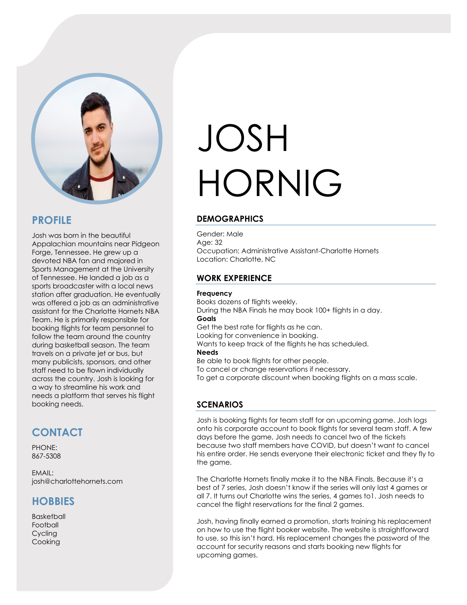

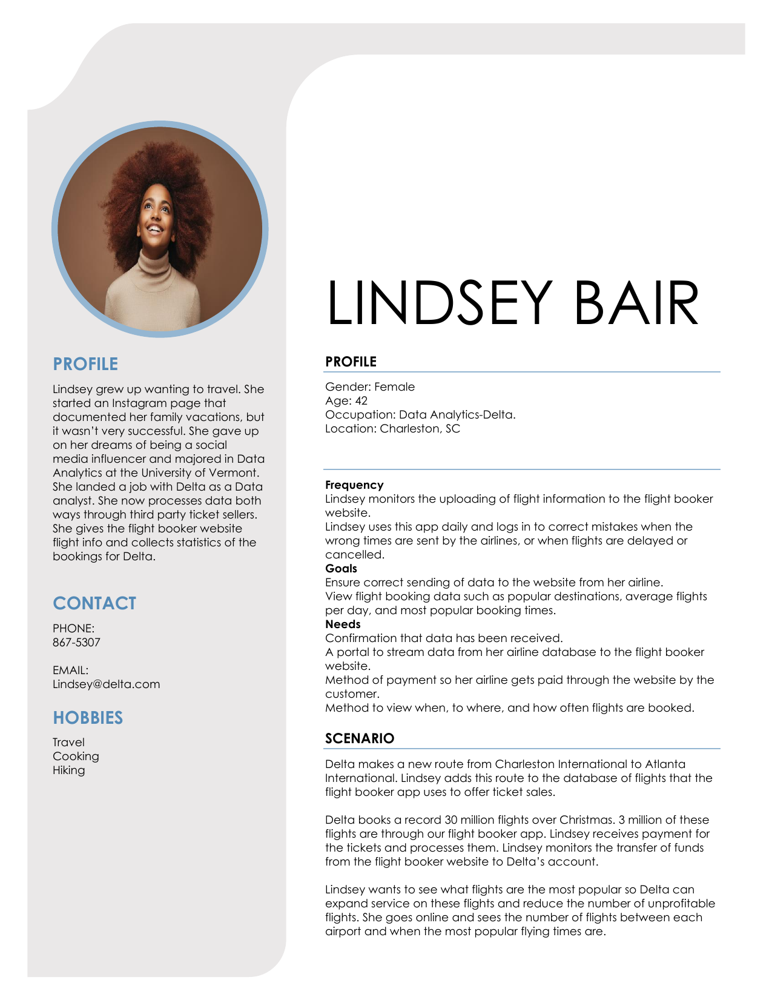

## Constraints

The flight booking project comes with serveral constraints that must be
accounted for. A primary constraint with the developer team is in conflicting
schedules that interfere with the time the developers can meet to discuss
and collaborate on the project. Correlating to this constraint is that the
team are all full-time University students with other responsibilities,
classes, and assignments. Additionally, the developer team works remotely,
which introduces collaboration difficulties. Another constraint is the
possibility of a finite budget available for the project. If this is the
case, there may need to be consideration for developer salary,
integration/partner fees, and royalty fees for design elements. There is also
the need for a server to handle server-side processing, storage, and
credential validation. This is a finanicial and logistic cost. It also
introduces a data management constraint of storing a large amount of data
securely and being able to export that info to external systems (Ex. 
Moving ticket to apple wallet) along with importing data (Ex. External 
bank information).  A final constraint is the limited technology and 
tools that the developer team has access to in their remote workspaces.

## Overall Description

This document contains both the conveniences and inconveniences of popular
travel booking websites. A new travel booking software will be created to
improve on competitors mishaps while creating a great user experience. It
also contains a list of stakeholders for the prospective software solution.
The document emphasizes the demands and wants of each of the stakeholders for
this new software. It further describes the constraints, requirements, and
use cases for the new software.

For the software portion, the system will need to interface with airline flight
information to obtain all flight departure and arrival times, prices for
flights, etc. It will need to be able to obtain ticket information from each
airline and handle purchasing tickets through the airline selected by the user.
We will also implement other software such as email clients for account making,
integration with popular purchase methods, possibly including PayPal and Apple
Pay, and giving access for the user to add their ticket to a virtual phone wallet
for the ease of boarding. The system will need to be able to interface with airline
tracking systems to provide flight status checking and flight tracking. If the client
wishes to include a reward system, we will need to implement that functionality or
interface with an existing one.

For hardware requirements, the software will be accessible via laptop, PC,
phone, and tablet. A backend server would be needed for server-side processing,
secure storage, and credential validation. This will need to have adequate
specifications for the scale of the market and continual uptime to ensure
the user can book flights at any time. A backend database will be required to
store information. A backup server and backup storage would likely be
beneficial, if not necessary for product release.

## Use Cases

## Functional Requirements

[Functional Requirements Document](https://docs.google.com/spreadsheets/d/1Xk8rFzc-kmWawB75tlEwK1by8CzAQHuVhvXCxGaEMFE/edit?usp=sharing)

## Non-Functional Requirements

[Non-Functional Requirements Document](https://docs.google.com/spreadsheets/d/1pySAAxS-EFAiLC-8LNY4ZvkV13Csb1hJit0mCkhEU18/edit?usp=sharing)

## Definitions and Acronyms

The System - The Flyter flight booking program and all of its included classes, interfaces, databases, and other files.

The User - A potential customer of the Flyter system who would book a flight through Flytr

UML - Unified Modeling Language - a standardized method of describing the design of a program and the relation of all of the classes, methods and interfaces.

## Competitive Analysis

We conducted a competitive analysis of three flight booking websites with three
distinct market objectives. These three capture a wide swath of the flight booking
marketshare.

Review Conducted By: Daniel Gleaves

- [Expedia](#expedia)
  - [Audience](#audience)
  - [Screenshots](#screenshots)
  - [Navigation](#navigation)
  - [Visual Audit](#visual-audit)
  - [Special Features and Supported Tasks](#special-features-and-supported-tasks)
  - [Design and Usability Notes](#design-and-usability-notes)
  - [Considerations for Final Project](#considerations-for-final-project)
- [Delta](#delta)
  - [Audience](#audience)
  - [Screenshots](#screenshots)
  - [Navigation](#navigation)
  - [Visual Audit](#visual-audit)
  - [Special Features and Supported Tasks](#special-features-and-supported-tasks)
  - [Design and Usability Notes](#design-and-usability-notes)
  - [Considerations for Final Project](#considerations-for-final-project)
- [Booking.com](#booking.com)
  - [Audience](#audience)
  - [Screenshots](#screenshots)
  - [Navigation](#navigation)
  - [Visual Audit](#visual-audit)
  - [Special Features and Supported Tasks](#special-features-and-supported-tasks)
  - [Design and Usability Notes](#design-and-usability-notes)
  - [Considerations for Final Project](#considerations-for-final-project)

### [Expedia](https://www.expedia.com/Flights)

The first competitor we consider is Expedia. Expedia assumes a central position
in the travel booking market, with the 23 distinct travel-related corporations under
the Expedia Group banner. Many of these booking sites share similar to identical
interfaces, so considering the main Expedia site will provide a glimpse at them all.

Before going into the website itself, the first thing to consider is that Expedia
has the top advertisement on Google search currently for flight related
searches. This will bring in lots of users seeking to book a flight and puts
them ahead of the other two competitors in terms of user acquisition.

#### Audience

- First-time flyers who clicked their ad on Google search
- Budget flyers
- Individuals looking for a cheap vacation destination
- Customer checking on flight information

#### Screenshots

##### Home Page

##### Search Results Page

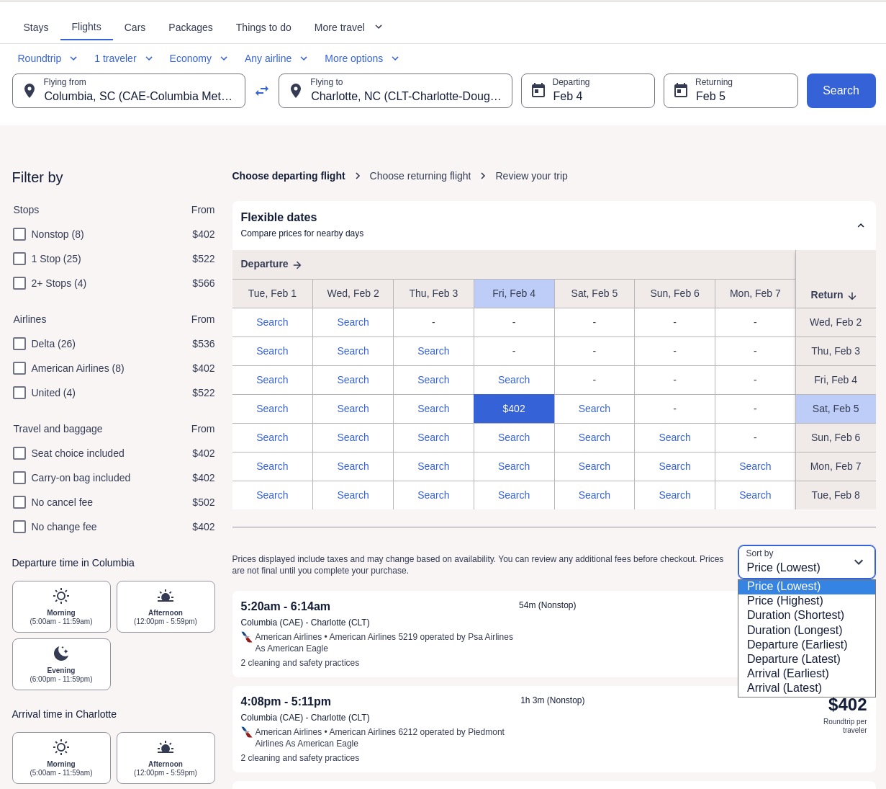

##### Flight Selected Page

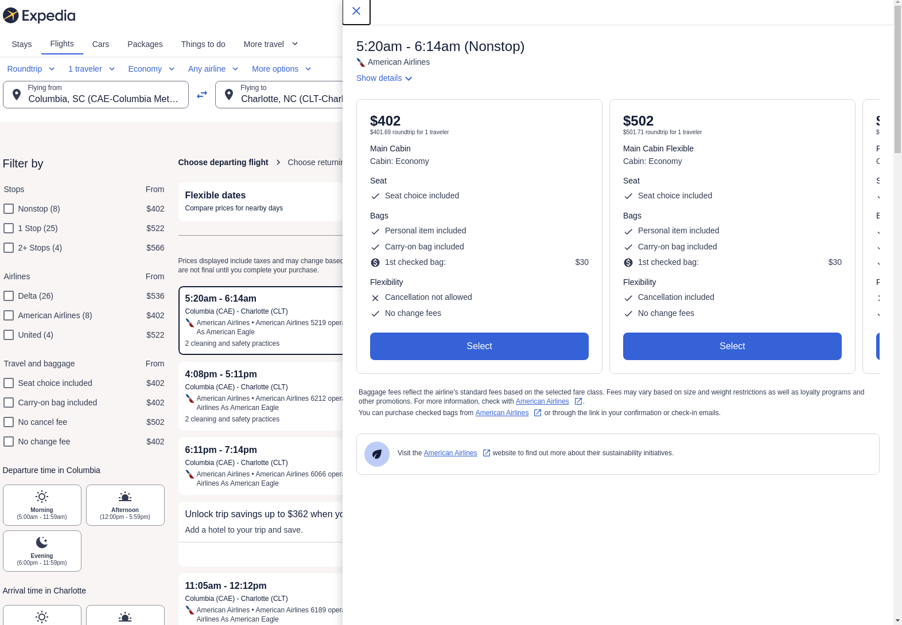

##### Cart Page

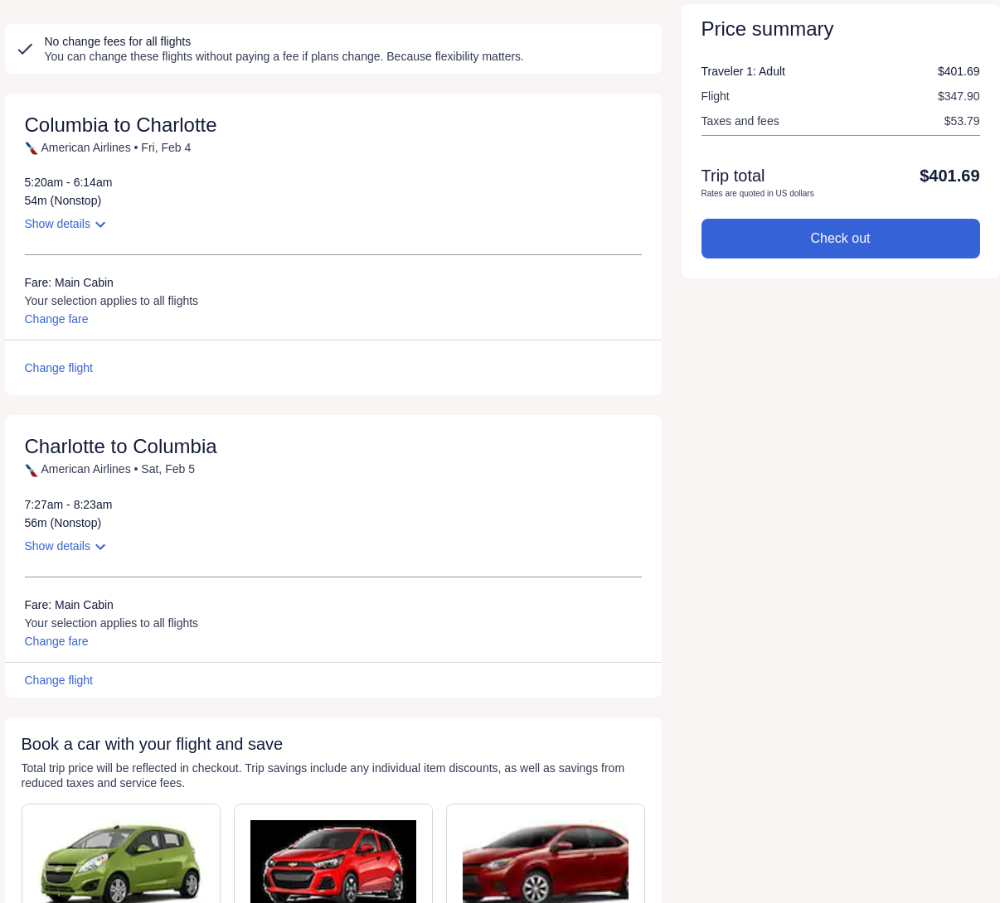

##### Checkout Page

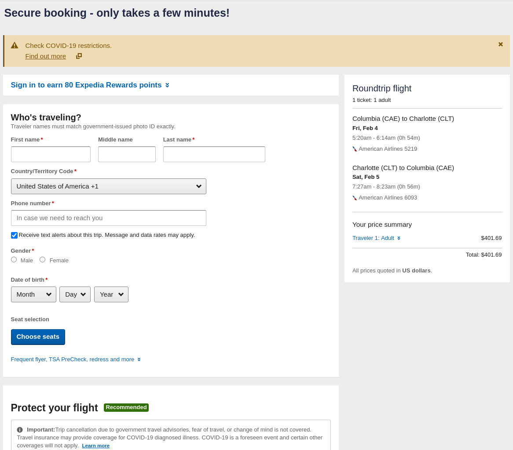

#### Navigation

##### Main Navigation

The main navigation presents a simple, clean interface for searching for flights
and an area for promotions.

Contains: Flight Search, Promoted Destinations, Promoted Deals, and a promotion
for their app.

##### Header Left Navigation

The upper left navigation provides a drop-down menu for their
other travel-related booking websites.

Contains: More Travel drop-down and options.

##### Header Right Navigation

The upper right navigation provides standard language selection, support, account
sign-in, and more. It does not seem necessary to include a property listing button
on a flight booking page, and having a "Trips" button seems repetitive with also
having a log-in button.

Contains: English (language select - 3 languages), List your property, Support,
Trips, and Sign in.

##### Footer Navigation

The footer contains all common and necessary footer elements. It is very expansive,
and contains repetitive elements and possibly unnecessary categories as well
that could be removed. However, at the footer it is less of an issue to have too
many options.

Contains: Company (About, Jobs, Partnerships, etc.), Explore (Travel guides),
Terms and Policies (Privacy policy, Terms of use, Accessibility), and
Help (Support, Cancel booking, and travel documents.

#### Visual Audit

- On the flight home page, they use the lower portion of the screen for promotion.
  While this could inspire users to travel for vacation to one of these destinations,
  if the user is on the site, they likely already have a destination in mind.
  With this in mind, they could remove the promotions or move them to a
  sub-page called "Explore" to greatly clean up and simplify the main
  landing/search page.
- The departing and returning date selection provides a two-month view. This seems
  clunky and takes up a lot of screen space. It would be easier and to have a single
  month view with a buffer of ~7 days after each month grayed out and simply page
  through each month one month at a time.
- The website displays an error when attempting to book 6+ people at a time. Instead,
  they could simply prevent more from being selected and display (Max capacity
  reached - 6) or something similar.

#### Special Features and Supported Tasks

- Purchase flight tickets from any airline for up to 6 people
- Drop-down for flexible date searches
- Sort and Filter search results
- Select Departing and Returning flights individually
- The search box has a search history drop-down
- Account usage for trip status checking

#### Design and Usability Notes

- Their search area uses a very nice color scheme, and it is very easy to tell
  what information needs to be filled out and can be clicked on.
- On the search results page, if you look at the flexible date selection,
  it is just a table full of search options. While this is acceptable, it may be
  more beneficial from a user standpoint to be shown the cheapest flight with their
  current options. This will give the user a price comparison, instead of manually
  searching each day.
- Once a flight is selected, a half-page horizontal scrolling page comes up
  with ticket options. This is not visually appealing and is not immediateley clear
  that there are more options off-screen to the right. They would benefit by
  replacing this with either a dedicated page or use vertical scrolling.

#### Considerations for Final Project

- Expedia had the most modern and intuitive search boxes. Their interface will be
  the most important to make sure we improve upon and use the same design principles.
- Having a flexible date calendar view could be useful, but we should make it
  more usable by having it show the lowest ticket price for the ticket type the
  user has searched for.

### [Delta](https://www.delta.com/)

The Delta flight booking website is the website to book flights for Delta Air
Lines. We selected this to gain insight into how a single-airline booking
service differed from other booking services.

#### Audience

- Brand-loyal flyers
- Repeat flyers with Delta
- Business flyers with a partnership with Delta
- Budget flyers who shop around themselves

#### Screenshots

##### Home Page

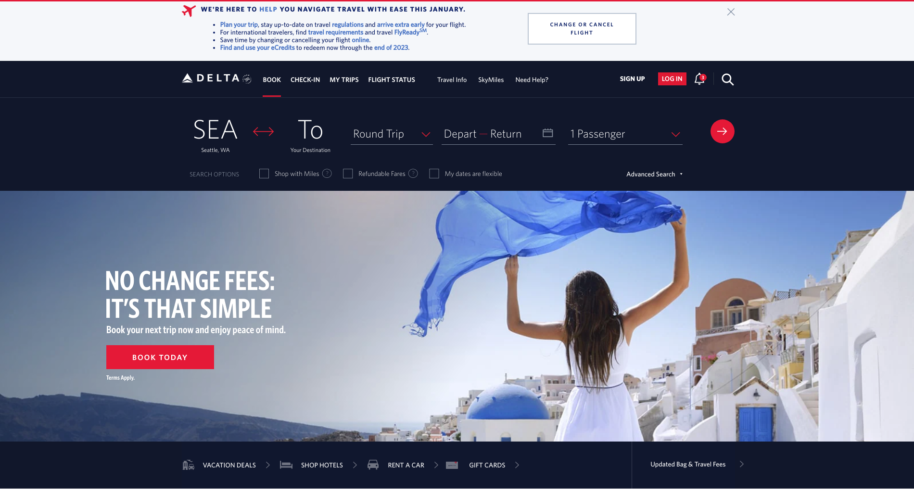

##### Search Results Page

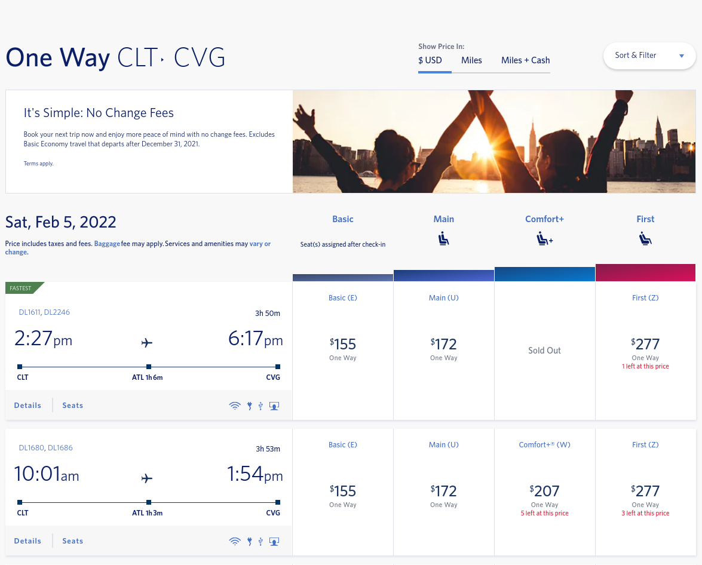

##### Flight Popup

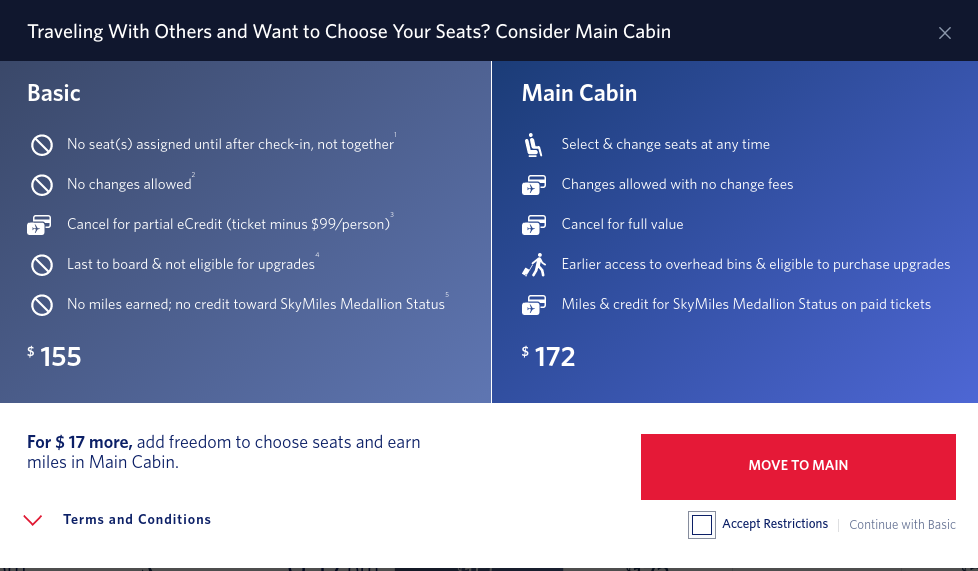

##### Cart Page

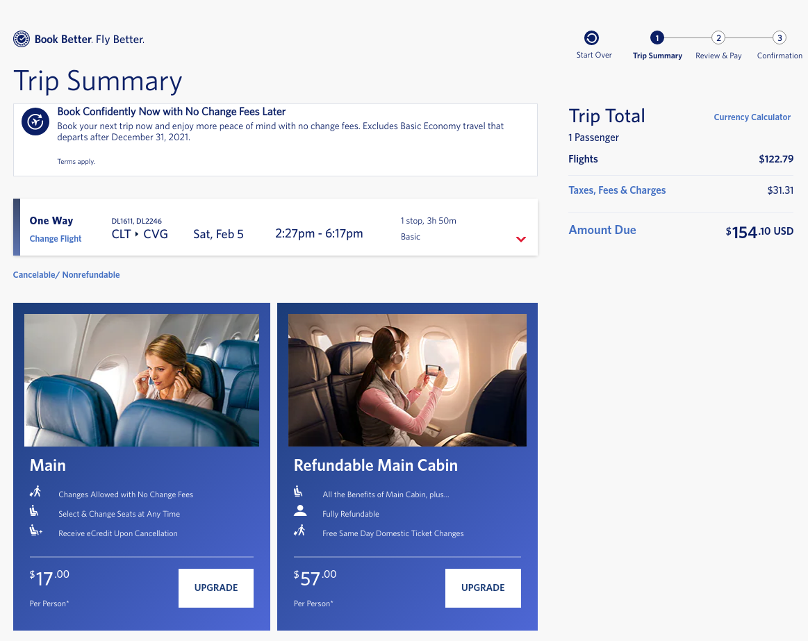

##### Checkout Page

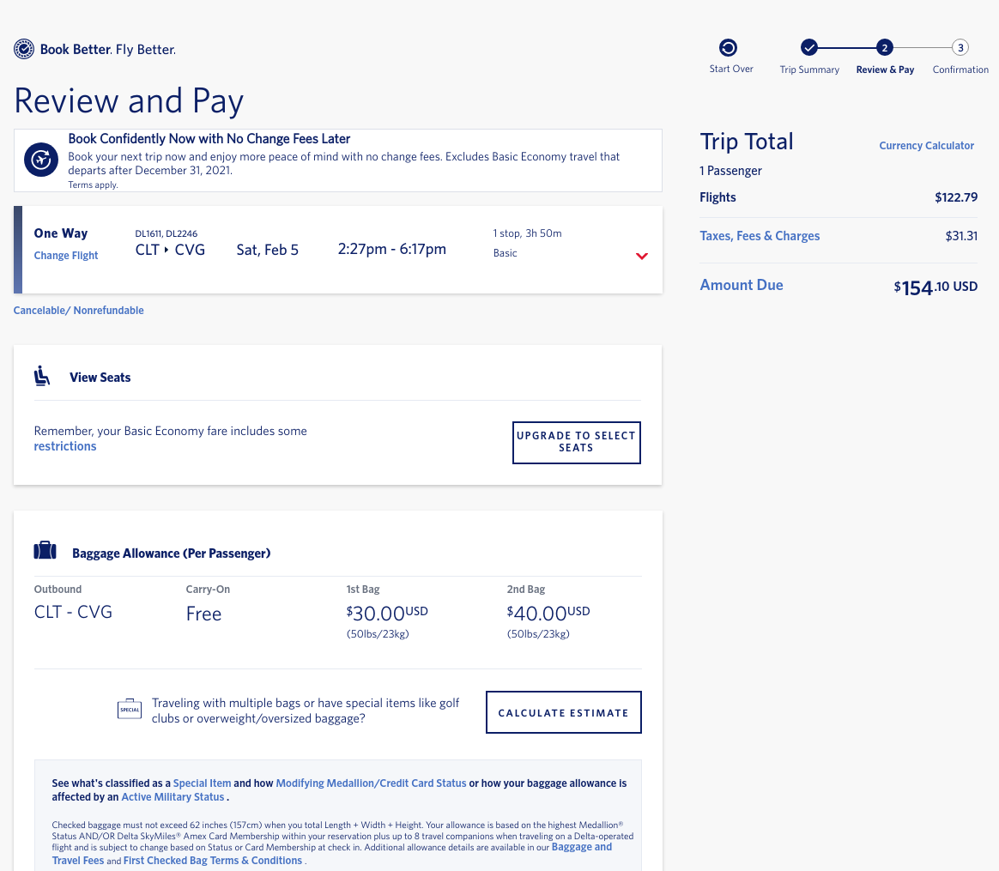

#### Navigation

##### Main Navigation

The main navigation includes the flight search box and Delta blog posts.

Contains: Flight Search, Promotion, Blog Posts, and Delta App.

##### Header Left Navigation

The upper left of the header contains important flight-related navigation.

Contains: Book, Check-In, My Trips, and Flight Status.

##### Header Middle Navigation

The middle header contains navigation to Delta-specific programs.

Contains: Travel Info, SkyMiles, and Need Help? drop-down menus.

##### Header Right Navigation

The upper right of the header contains account and notification information.

Contains: Sign Up, Log In, Notification Bell, Search (blog posts).

##### Footer Navigation

The footer contains the common footer information, support, and customer service
links.

Contains: About Delta, Customer Service, Site Support, and Policies.

#### Visual Audit

- The color scheme used for the flight search is too dark for the thin font used.
- It is difficult to tell what items are clickable as they are not outlined and seem
  like simply text on the page.
- The flight search results are presented more like an info-graphic than something
  a user is supposed to scroll through and interact with.

#### Special Features and Supported Tasks

- Flight Status Checking
- Book a Delta flight
- Book flight using SkyMiles
- Sort and Filter search results
- Select Departing and Returning flights individually
- Flexible dates with lowest price view

#### Design and Usability Notes

- It is not immediately clear what is clickable on the home page with everything
  being the same color.
- You are able to select a return date before the departing date.
- The date selection is difficult to use as it takes the first selected date as the
  departure date and the second date chosen as the return date, but does not show
  that their will be a return date until after the first date is chosen. It
  should display each separately to be more intuitive.
- It has a more limited selection as it is only Delta flights.
- There is a large section of the home page dedicated to a No Change Fees advertisement
  with a "Book Today" button. However, when clicked it simply takes you to
  another page with the same search bar as the home page. They could remove
  this button, as it is a redundant page.
- The only way to change the site language is to scroll to the bottom and find
  the small piece of text for it.

#### Considerations for Final Project

- The interface should be minimal at each stage.
- Every page should be designed with intuitive user interaction in mind and user
  tested.
- It would likely be beneficial to have a flight status checker.
- Changing the site language, if we had multiple languages, should be in the right
  side of the header.
- This website does not include hotel or other travel-related booking, so the navigation
  we use would benefit from considering theirs to fill the space and have
  useful links.
- One of the benefits of using Delta would be using the SlyMiles with the specific
  air line. This might be something to integrate or have our own system for.

### Booking.com

Booking is a large-scale travel booking website. While a focus may now be or have
previously been on hotel booking, they offer a mixed variety of travel booking options,
including flights. We selected Booking to get a secondary budget option not
owned by Expedia Group and consider how important integration with other travel
booking is.

#### Audience

- Users looking to make all travel bookings through the same website
- Budget flyers
- Business travelers
- First time travelers/flyers

#### Screenshots

##### Landing Page

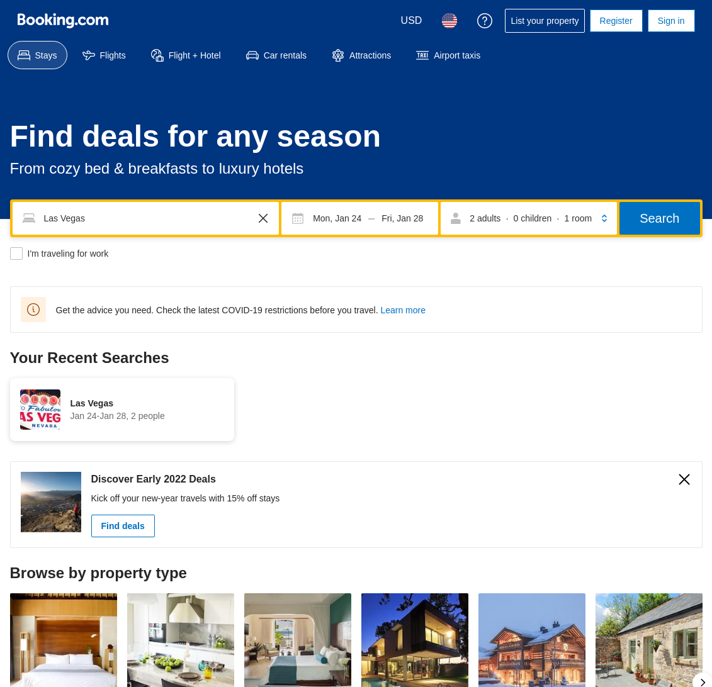

##### Flight Home Page

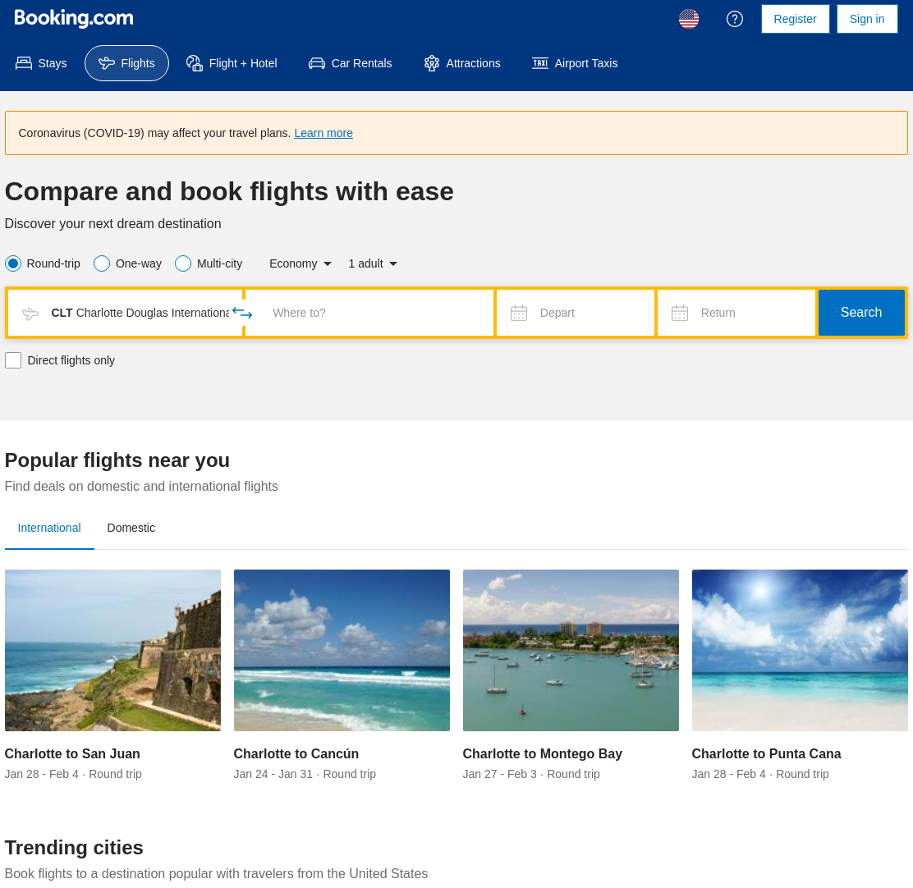

##### Search Results Page

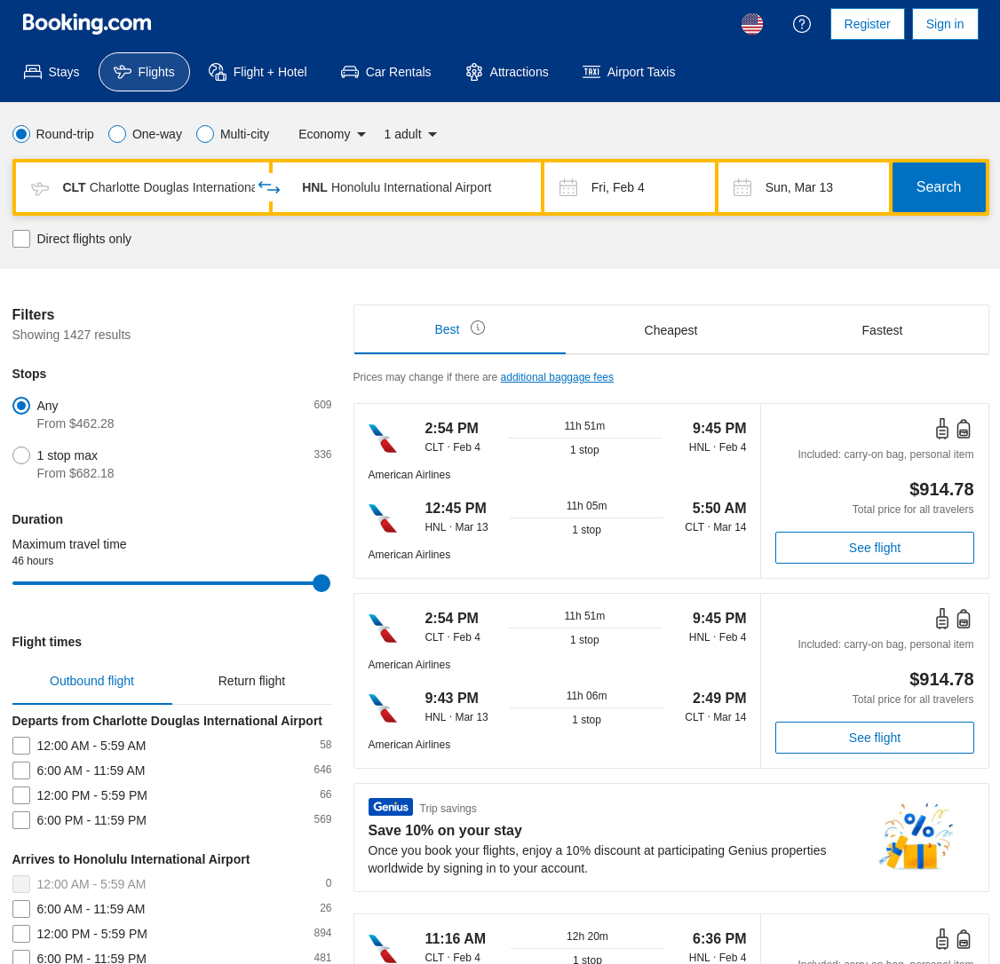

##### Flight Preview

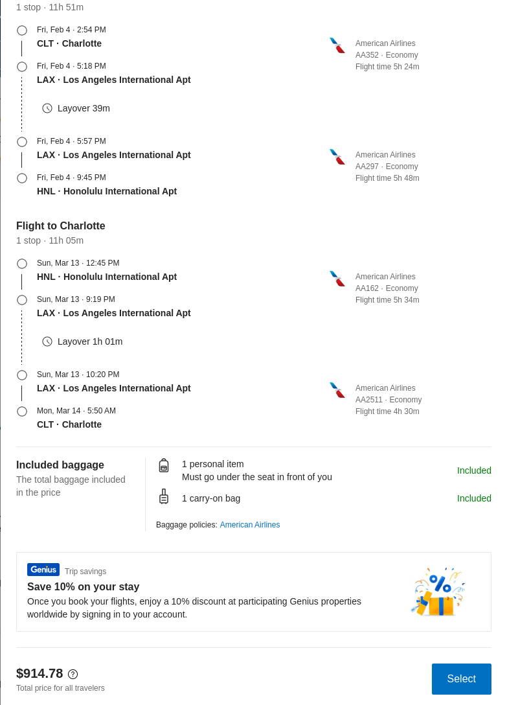

##### Checkout Page

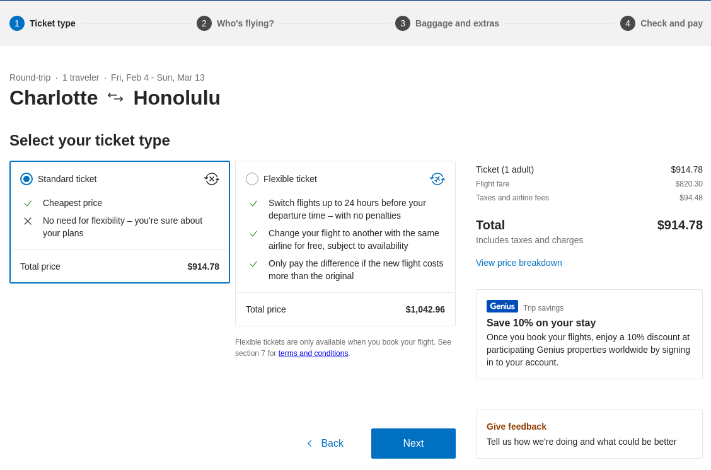

#### Navigation

##### Main Navigation

The main navigation bar provides links to each of their other travel-related booking
services.

Contains: Stays, Flights, Flight + Hotel, Car Rentals, Attractions, and Airport Taxis.

##### Header Right Navigation

The upper right navigation has standard language selection and account options.

Contains: Language, Help and Support, Register, and Sign in.

##### Footer Navigation

The main footer options provide standard footer information and navigation links.

Contains: About Booking.com, Terms & Conditions, Privacy and Cookie Statement, and
Flights Help.

#### Visual Audit

- The color scheme is beneficial for usability. It is not the most visually appealing,
  but it is usable.
- The overall interface is very blocky, which seems to be an outdated style.
  They could
  switch to rounded corners with a bit more colorful accent colors and have a more
  visually appealing interface.

#### Special Features

- Purchase flight ticket from any airline
- Flight preview page to see stops and times for each step of flight.
- Dedicated main-page button for direct flights
- A "best" flight search sorting
- A website feedback button
- Sort and Filter search results
- Allows searching for multiple destination airports at once
- Account usage for easy check-out and trip checking

#### Design and Usability Notes

- The language select does not have any accompanying text, it is just a circle
  with an American flag icon. This is not immediately identifiable as language
  selection, and would be better if it had text identifying it as the language
  selection box.
- Similarly, the help and support button is only an icon, but this is not as difficult
  to understand. It still could benefit from being a Support button, however.
  It does not allow for selecting departing and returning flights separately.

#### Considerations for Final Project

- It would likely be beneficial to include a flight preview page, either
  optionally or otherwise.
- Something consistent across each is having promotions underneath the main
  search box. We might consider either removing these to clean up the space, or
  follow Booking and have it show popular flights in the user's area or the most
  popular destinations across the app.
- We should have selecting departing and returning flights separately. This
  cleans up the search results considerably and makes it more intuitive to use.

### Summary

#### Product Comparison

|            Feature            | Expedia   |  Delta    | Booking.com   |
|:----------------------------: |:-------:  |:-------:  |:-----------:  |
| Book Hotel                    | &cross;   |           |   &cross;     |
| Book Flight                   | &cross;   | &cross;   |   &cross;     |
| Multiple Airlines             | &cross;   |           |   &cross;     |
| Search Multiple Destinations  |           |           |   &cross;     |
| Flexible Dates                | &cross;   | &cross;   |               |
| Flexible Tickets              | &cross;   | &cross;   |   &cross;     |
| Flight Preview Page           |           |           |   &cross;     |
| Flight Status Check           |           | &cross;   |               |
| Round-trip Flight             | &cross;   | &cross;   |   &cross;     |
| One-way Flight                | &cross;   | &cross;   |   &cross;     |
| Multi-city Flight             | &cross;   | &cross;   |   &cross;     |
| Main Page Promotions          | &cross;   | &cross;   |   &cross;     |
| Pay with Credit Card          | &cross;   | &cross;   |   &cross;     |
| Rewards Program               | &cross;   | &cross;   |   &cross;     |

#### Analysis

The biggest takeaway from considering each of the competitors is that we need to
have a minimal, streamlined process for booking a flight. We may consider
following Delta in only providing flight booking instead of hotels and other
travel bookings. In order to deliver a product within the desired timeline, we
should focus on creating a modern, minimal, and intuitive interface for our
product. Part of this is choosing a good color scheme that is not too dark to
promote readability, which
is something Delta did not do. Navigation should be clear with accompanying text
for any buttons. We will need to consider what we want to do with the space below
the search box if we want to leave it empty to be more minimal or include promoted
or popular flights as each of the competitors do. Another feature to consider is
a frequent flyer reward system that each of our competitors do. If we have an
account system, this would be a good way to have returning users.

## References

Expedia. Expedia.com. Accessed 2/1/2022.

Travelocity. Travelocity.com. Accessed 2/1/2022.

Google Java Style Guide. https://google.github.io/styleguide/javaguide.html. Accessed 2/1/2022.

Airline Fares Regulations, US Department of Transportation. https://www.transportation.gov/policy/aviation-policy/airline-rules-fares Accessed 2/1/2022.

Booking.com. Accessed 2/1/2022.

Delta Airlines. Delta.com. Accessed 2/1/2022.

## Appendices

Google Java Style Guide. https://google.github.io/styleguide/javaguide.html

UML Class Diagram Tutorial. https://www.visual-paradigm.com/guide/uml-unified-modeling-language/uml-class-diagram-tutorial/

